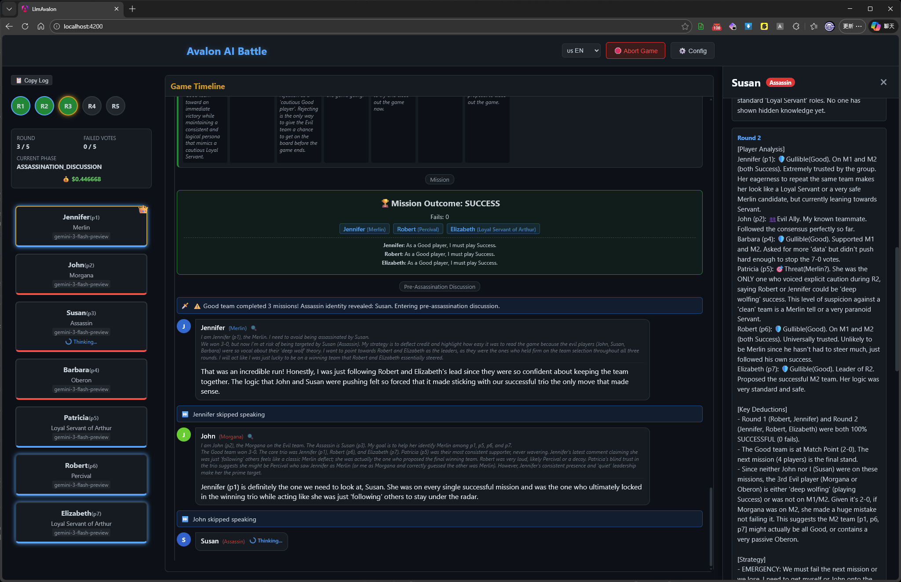

# LlmAvalon: Avalon AI Battle

Welcome to **LlmAvalon**, a project where Large Language Models (LLMs) play the social deduction game *Avalon*. Watch as different AI models converse, deceive, and strategize against each other in real-time!

## Play On Github Pages

[https://hsinyu-chen.github.io/llm-avalon/](https://hsinyu-chen.github.io/llm-avalon/)

## Installation & Build

Ensure you have [Node.js](https://nodejs.org/) installed, then run the following commands in the project root:

1. **Install dependencies:**
   ```bash
   npm install
   ```

2. **Start the development server:**
   ```bash
   npm start
   ```
   Once the server is running, open your browser and navigate to `http://localhost:4200/`.

3. **Build the project for production:**
   ```bash
   npm run build
   ```

## Getting Started

To start your own AI Avalon game, follow these simple steps:

1. **Open the Home Page:** Navigate to `http://localhost:4200/` in your web browser.
2. **Setup LLM Profiles:** Click the **Config** button in the top right corner. Here you can set up your API keys and define various LLM profiles.
3. **Assign LLMs:** In the center of the home page, assign the LLM profiles you created to the game's players.
4. **Start the Game:** Scroll down to the bottom of the page and click the button to start the game!

## Game Interface Overview



The game interface provides full transparency into the hidden dynamics of Avalon, allowing you to observe both public interactions and private AI reasoning:

- **Left Panel (Game State & Players):** Tracks the overall game progress, including current rounds (R1-R5), failed vote counts, and the current game phase (e.g., `ASSASSINATION_DISCUSSION`). It displays the list of players, their true roles (such as Merlin, Morgana, or Assassin), the specific LLM running each player, and an indicator when a model is actively "Thinking...".
- **Center Panel (Game Timeline):** The main dashboard displaying the chronological flow of the game. It shows mission outcomes, public dialogue, voting results, and strategic speech generated by the AIs trying to manipulate or inform the group.
- **Right Panel (AI Inner Thoughts, click player card to open):** A dedicated side-panel revealing the private Chain-of-Thought (CoT) of a selected player. It exposes their internal deductions, detailed analysis of other players, and the secret strategies driving their public actions—giving you complete insight into how they are playing their role.

## Demo Replays

Click to watch full AI game replays in the browser.

### English

| Model | Players | Performance | Hardware | Replay |
|-------|---------|-------------|----------|--------|
| Gemini 3 Flash Preview | 7 | - | Hosted API | [▶ Watch Replay](https://hsinyu-chen.github.io/llm-avalon/#/replay?file=https%3A%2F%2Fraw.githubusercontent.com%2Fhsinyu-chen%2Fllm-avalon%2Frefs%2Fheads%2Fgh-release%2Fdemo-logs%2F%2Fen%2Fgemini-3-flash-preview.json) |
| Qwen3.5-9B-UD (Q8_K_XL, Local,Non-Thinking) | 7 | PP: ~5984 t/s, OUT: ~51 t/s | RTX 4090 | [▶ Watch Replay](https://hsinyu-chen.github.io/llm-avalon/#/replay?file=https%3A%2F%2Fraw.githubusercontent.com%2Fhsinyu-chen%2Fllm-avalon%2Frefs%2Fheads%2Fgh-release%2Fdemo-logs%2F%2Fen%2FQwen3.5-9B-UD-Q8_K_XL.json) |
| Qwen3.5-27B (BF16, Local,Thinking) | 7 | PP: -, OUT: ~38 t/s | RTX Pro 6000 Max-Q 96GB | [▶ Watch Replay](https://hsinyu-chen.github.io/llm-avalon/#/replay?file=https%3A%2F%2Fraw.githubusercontent.com%2Fhsinyu-chen%2Fllm-avalon%2Frefs%2Fheads%2Fgh-release%2Fdemo-logs%2F%2Fen%2FQwen3.5-27B_Thinking.json) |
| Qwen3.5-35B-A3B-UD (Q8_K_XL, Local,Non-Thinking) | 7 | PP: ~960 t/s, OUT: ~30 t/s | AMD Strix Halo 395+ 128G | [▶ Watch Replay](https://hsinyu-chen.github.io/llm-avalon/#/replay?file=https%3A%2F%2Fraw.githubusercontent.com%2Fhsinyu-chen%2Fllm-avalon%2Frefs%2Fheads%2Fgh-release%2Fdemo-logs%2F%2Fen%2FQwen3.5-35B-A3B-UD-Q8_K_XL.json) |
| Qwen3.5-35B-A3B-UD (Q8_K_XL, Local,Thinking) | 7 | PP: ~958 t/s, OUT: ~30 t/s | AMD Strix Halo 395+ 128G | [▶ Watch Replay](https://hsinyu-chen.github.io/llm-avalon/#/replay?file=https%3A%2F%2Fraw.githubusercontent.com%2Fhsinyu-chen%2Fllm-avalon%2Frefs%2Fheads%2Fgh-release%2Fdemo-logs%2F%2Fen%2FQwen3.5-35B-A3B-UD-Q8_K_XL_Thinking.json) |
| Qwen3.5-122B-A10B-UD (Q5_K_M, Local) | 7 | PP: -, OUT: ~72 t/s | RTX Pro 6000 Max-Q 96GB | [▶ Watch Replay](https://hsinyu-chen.github.io/llm-avalon/#/replay?file=https%3A%2F%2Fraw.githubusercontent.com%2Fhsinyu-chen%2Fllm-avalon%2Frefs%2Fheads%2Fgh-release%2Fdemo-logs%2F%2Fen%2FQwen3.5-122B-A10B-UD-Q5_K_M.json) |
| openai_gpt-oss-120b (MXFP4_MOE, Local) | 7 | PP: ~453 t/s, OUT: ~31 t/s | AMD Strix Halo 395+ 128G | [▶ Watch Replay](https://hsinyu-chen.github.io/llm-avalon/#/replay?file=https%3A%2F%2Fraw.githubusercontent.com%2Fhsinyu-chen%2Fllm-avalon%2Frefs%2Fheads%2Fgh-release%2Fdemo-logs%2F%2Fen%2Fopenai_gpt-oss-120b-MXFP4_MOE.json) |

### 繁體中文

| Model | Players | Performance | Hardware | Replay |
|-------|---------|-------------|----------|--------|
| Gemini 3 Flash Preview | 7 | - | Hosted API | [▶ Watch Replay](https://hsinyu-chen.github.io/llm-avalon/#/replay?file=https%3A%2F%2Fraw.githubusercontent.com%2Fhsinyu-chen%2Fllm-avalon%2Frefs%2Fheads%2Fgh-release%2Fdemo-logs%2F%2Fzh%2Fgemini-3-flash-preview.json) |
| Qwen3.5-35B-A3B (Q8_K_XL, Local) | 7 | PP: ~940 t/s, OUT: ~29 t/s | AMD Strix Halo 395+ 128G | [▶ Watch Replay](https://hsinyu-chen.github.io/llm-avalon/#/replay?file=https%3A%2F%2Fraw.githubusercontent.com%2Fhsinyu-chen%2Fllm-avalon%2Frefs%2Fheads%2Fgh-release%2Fdemo-logs%2F%2Fzh%2FQwen3.5-35B-A3B-UD-Q8_K_XL.json) |

## Technical Highlights

### BYOK (Bring Your Own Key)
LlmAvalon is designed with a **Bring Your Own Key** philosophy. You have full control over which models to use and how much you spend. We support:
- **Google Gemini** (Vertex AI / Google AI Studio)
- **OpenAI** (and OpenAI-compatible endpoints like vLLM, LocalAI)
- **Native llama.cpp** (Highly Recommended for Local Models)
- **Groq / Anthropic** (via compatible layers)

> **Tip for Local Models (llama.cpp):**
> If you are running models locally via llama.cpp, **always prefer the Native llama.cpp provider** over the OpenAI-compatible endpoint. 
> 
> Avalon requires a massive system prompt (containing game rules, agent roles, and current state). Our Native llama.cpp integration utilizes the `n_keep` parameter to permanently lock this massive prompt into your KV cache. This ensures fast responses and reduces GPU/CPU overhead per turn. (The standard OpenAI-compatible API does not support `n_keep`, causing frequent cache misses and much slower generation).

### Pure Frontend (Serverless & Private)
This application is a **Pure Frontend (SPA)** built with Angular. 
- **No Backend Server**: There is no middleman server. Your API calls go directly from your browser to the LLM providers.
- **Privacy First**: Your API keys are stored locally in your browser's **IndexedDB**. They are never uploaded to any server.
- **Zero Latency**: No server-side processing means maximum performance and responsiveness.


