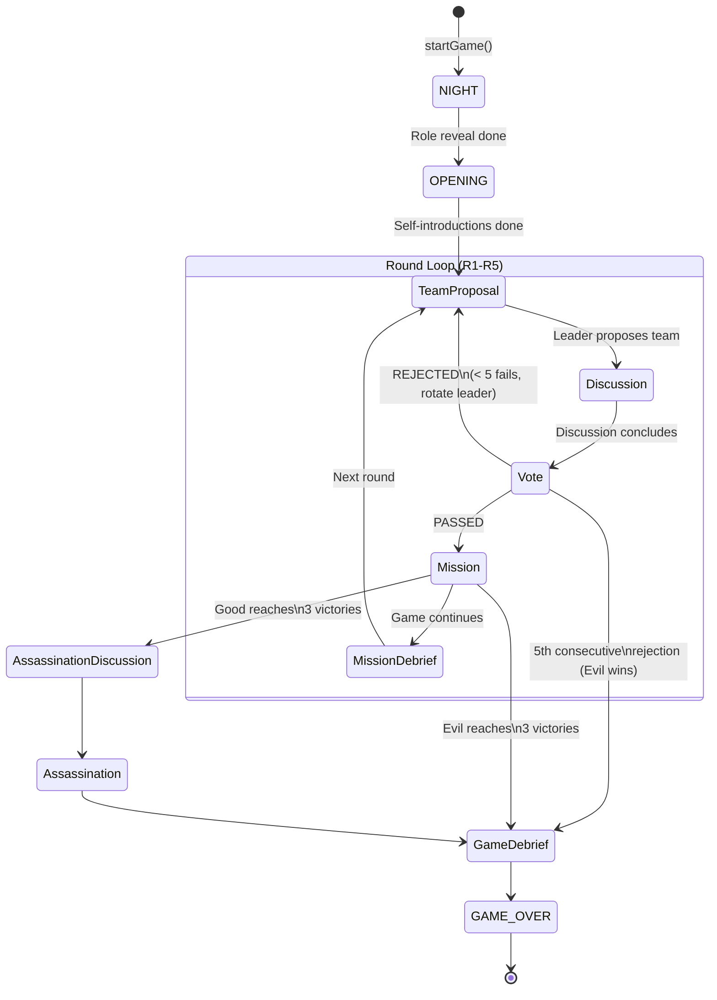

# LlmAvalon: Avalon AI Battle

English | [繁體中文](./README.zh-tw.md)

Welcome to **LlmAvalon**, a project where Large Language Models (LLMs) play the social deduction game *Avalon*. Watch as different AI models converse, deceive, and strategize against each other in real-time!

## Play On Github Pages

[https://hsinyu-chen.github.io/llm-avalon/](https://hsinyu-chen.github.io/llm-avalon/)

## Installation & Build

Ensure you have [Node.js](https://nodejs.org/) installed, then run the following commands in the project root:

1. **Install dependencies:**
   ```bash
   npm install
   ```

2. **Start the development server:**
   ```bash
   npm start
   ```
   Once the server is running, open your browser and navigate to `http://localhost:4200/`.

3. **Build the project for production:**
   ```bash
   npm run build
   ```

## Getting Started

To start your own AI Avalon game, follow these simple steps:

1. **Open the Home Page:** Navigate to `http://localhost:4200/` in your web browser.
2. **Setup LLM Profiles:** Click the **Config** button in the top right corner. Here you can set up your API keys and define various LLM profiles.
3. **Assign LLMs:** In the center of the home page, assign the LLM profiles you created to the game's players.
4. **Start the Game:** Scroll down to the bottom of the page and click the button to start the game!

## Game Interface Overview


The game interface provides full transparency into the hidden dynamics of Avalon, allowing you to observe both public interactions and private AI reasoning:

- **Left Panel (Game State & Players):** Tracks the overall game progress, including current rounds (R1-R5), failed vote counts, and the current game phase (e.g., `ASSASSINATION_DISCUSSION`). It displays the list of players, their true roles (such as Merlin, Morgana, or Assassin), the specific LLM running each player, and an indicator when a model is actively "Thinking...".
- **Center Panel (Game Timeline):** The main dashboard displaying the chronological flow of the game. It shows mission outcomes, public dialogue, voting results, and strategic speech generated by the AIs trying to manipulate or inform the group.
- **Right Panel (AI Inner Thoughts, click player card to open):** A dedicated side-panel revealing the private Chain-of-Thought (CoT) of a selected player. It exposes their internal deductions, detailed analysis of other players, and the secret strategies driving their public actions—giving you complete insight into how they are playing their role.

## Demo Replays

Click to watch full AI game replays in the browser.

### English

| Model | Players | Performance | Hardware | Replay |
|-------|---------|-------------|----------|--------|
| Gemini 3 Flash Preview | 7 | - | Hosted API | [▶ Watch Replay](https://hsinyu-chen.github.io/llm-avalon/#/replay?file=https%3A%2F%2Fmedia.githubusercontent.com%2Fmedia%2Fhsinyu-chen%2Fllm-avalon%2Frefs%2Fheads%2Fgh-release%2Fdemo-logs%2Fen%2Fgemini-3-flash-preview.json) |
| Gemini 2.5 Flash Lite | 7 | - | Hosted API | [▶ Watch Replay](https://hsinyu-chen.github.io/llm-avalon/#/replay?file=https%3A%2F%2Fmedia.githubusercontent.com%2Fmedia%2Fhsinyu-chen%2Fllm-avalon%2Frefs%2Fheads%2Fgh-release%2Fdemo-logs%2Fen%2Fgemini-2.5-flash-lite.json) |
| Gemma-4-26B-A4B-it (BF16, Local,Non-Thinking) | 7 | PP: -, OUT: ~104 t/s | RTX Pro 6000 Max-Q 96GB | [▶ Watch Replay](https://hsinyu-chen.github.io/llm-avalon/#/replay?file=https%3A%2F%2Fmedia.githubusercontent.com%2Fmedia%2Fhsinyu-chen%2Fllm-avalon%2Frefs%2Fheads%2Fgh-release%2Fdemo-logs%2Fen%2Fgemma-4-26B-A4B-it.json) |
| Gemma-4-26B-A4B-it (BF16, Local,Thinking) | 7 | PP: -, OUT: ~111 t/s | RTX Pro 6000 Max-Q 96GB | [▶ Watch Replay](https://hsinyu-chen.github.io/llm-avalon/#/replay?file=https%3A%2F%2Fmedia.githubusercontent.com%2Fmedia%2Fhsinyu-chen%2Fllm-avalon%2Frefs%2Fheads%2Fgh-release%2Fdemo-logs%2Fen%2Fgemma-4-26B-A4B-it_Thinking.json) |
| Gemma-4-31B-it (BF16, Local,Non-Thinking) | 7 | PP: -, OUT: ~19 t/s | RTX Pro 6000 Max-Q 96GB | [▶ Watch Replay](https://hsinyu-chen.github.io/llm-avalon/#/replay?file=https%3A%2F%2Fmedia.githubusercontent.com%2Fmedia%2Fhsinyu-chen%2Fllm-avalon%2Frefs%2Fheads%2Fgh-release%2Fdemo-logs%2Fen%2Fgemma-4-31B-it.json) |
| Gemma-4-31B-it (BF16, Local,Thinking) | 7 | PP: -, OUT: ~19 t/s | RTX Pro 6000 Max-Q 96GB | [▶ Watch Replay](https://hsinyu-chen.github.io/llm-avalon/#/replay?file=https%3A%2F%2Fmedia.githubusercontent.com%2Fmedia%2Fhsinyu-chen%2Fllm-avalon%2Frefs%2Fheads%2Fgh-release%2Fdemo-logs%2Fen%2Fgemma-4-31B-it_Thinking.json) |
| Gemma-4-31B-it-UD (Q4_K_XL, Local,Thinking) | 7 | PP: ~229 t/s, OUT: ~8.6 t/s | AMD Strix Halo 395+ 128G | [▶ Watch Replay](https://hsinyu-chen.github.io/llm-avalon/#/replay?file=https%3A%2F%2Fmedia.githubusercontent.com%2Fmedia%2Fhsinyu-chen%2Fllm-avalon%2Frefs%2Fheads%2Fgh-release%2Fdemo-logs%2Fen%2Fgemma-4-31B-it-UD-Q4_K_XL_Thinking.json) |
| Qwen3.5-9B-UD (Q8_K_XL, Local,Non-Thinking) | 7 | PP: ~5984 t/s, OUT: ~51 t/s | RTX 4090 | [▶ Watch Replay](https://hsinyu-chen.github.io/llm-avalon/#/replay?file=https%3A%2F%2Fmedia.githubusercontent.com%2Fmedia%2Fhsinyu-chen%2Fllm-avalon%2Frefs%2Fheads%2Fgh-release%2Fdemo-logs%2Fen%2FQwen3.5-9B-UD-Q8_K_XL.json) |
| Qwen3.5-27B (BF16, Local,Thinking) | 7 | PP: -, OUT: ~38 t/s | RTX Pro 6000 Max-Q 96GB | [▶ Watch Replay](https://hsinyu-chen.github.io/llm-avalon/#/replay?file=https%3A%2F%2Fmedia.githubusercontent.com%2Fmedia%2Fhsinyu-chen%2Fllm-avalon%2Frefs%2Fheads%2Fgh-release%2Fdemo-logs%2Fen%2FQwen3.5-27B_Thinking.json) |
| Qwen3.5-35B-A3B-UD (Q8_K_XL, Local,Non-Thinking) | 7 | PP: ~960 t/s, OUT: ~30 t/s | AMD Strix Halo 395+ 128G | [▶ Watch Replay](https://hsinyu-chen.github.io/llm-avalon/#/replay?file=https%3A%2F%2Fmedia.githubusercontent.com%2Fmedia%2Fhsinyu-chen%2Fllm-avalon%2Frefs%2Fheads%2Fgh-release%2Fdemo-logs%2Fen%2FQwen3.5-35B-A3B-UD-Q8_K_XL.json) |
| Qwen3.5-35B-A3B-UD (Q8_K_XL, Local,Thinking) | 7 | PP: ~958 t/s, OUT: ~30 t/s | AMD Strix Halo 395+ 128G | [▶ Watch Replay](https://hsinyu-chen.github.io/llm-avalon/#/replay?file=https%3A%2F%2Fmedia.githubusercontent.com%2Fmedia%2Fhsinyu-chen%2Fllm-avalon%2Frefs%2Fheads%2Fgh-release%2Fdemo-logs%2Fen%2FQwen3.5-35B-A3B-UD-Q8_K_XL_Thinking.json) |
| Qwen3.5-122B-A10B-UD (Q5_K_M, Local) | 7 | PP: -, OUT: ~72 t/s | RTX Pro 6000 Max-Q 96GB | [▶ Watch Replay](https://hsinyu-chen.github.io/llm-avalon/#/replay?file=https%3A%2F%2Fmedia.githubusercontent.com%2Fmedia%2Fhsinyu-chen%2Fllm-avalon%2Frefs%2Fheads%2Fgh-release%2Fdemo-logs%2Fen%2FQwen3.5-122B-A10B-UD-Q5_K_M.json) |
| openai_gpt-oss-120b (MXFP4_MOE, Local) | 7 | PP: ~453 t/s, OUT: ~31 t/s | AMD Strix Halo 395+ 128G | [▶ Watch Replay](https://hsinyu-chen.github.io/llm-avalon/#/replay?file=https%3A%2F%2Fmedia.githubusercontent.com%2Fmedia%2Fhsinyu-chen%2Fllm-avalon%2Frefs%2Fheads%2Fgh-release%2Fdemo-logs%2Fen%2Fopenai_gpt-oss-120b-MXFP4_MOE.json) |

## Contributing Game Logs

We welcome community contributions of game logs! If you have an interesting game replay you'd like to share, please:

1. **Submit a Pull Request.**
2. **Place the log file** in the appropriate language directory under [`demo-logs/`](./demo-logs/) (e.g., `demo-logs/en/` or `demo-logs/zh/`).
3. **Name the file** after the model name (e.g., `your-model-name.json`).
4. **Update the table** in the [Demo Replays](#demo-replays) section of this `README.md` to include your new log.
5. **Get Performance Stats**: If you are using a local model, you can use our utility script to calculate the average prompt and completion speeds for the table:
   ```bash
   node scripts/calculate-log-stats.js demo-logs/en/your-model-name.json
   ```


## System Architecture & Interfaces

The project strictly uses TypeScript Interfaces to separate the game into three logical layers: **Core Game State**, **Agent Protocols & Actions**, and the **LLM Provider System**. This structure ensures the game rules, AI interactions, and language model APIs remain completely decoupled.

```text
src/app/
├── models/                             # Core Domain Models & Data Structures
│   │
│   ├── game-config.ts                  # [Environment] System & match configurations
│   │   └── interface: GameConfig
│   │
│   ├── game-state.ts                   # [Core State] State machine & game progress
│   │   └── interfaces: GameState, PlayerState, GameOptions...
│   │
│   ├── game-event.ts                   # [Event Bus] Event records for UI and timelines
│   │   └── interface: BaseGameEvent
│   │
│   ├── game-record.ts                  # [Replay Output] End-game summary & stats
│   │   └── interfaces: GameRecord, GameRecordPlayer, GameRecordTokenUsage
│   │
│   ├── role.ts                         # [Identities] Role & faction properties
│   │   └── interface: RoleMeta
│   │
│   └── agent.interface.ts              # [AI Protocols] LLM interaction contracts & Actions
│       ├── Agent Entity: IAgent
│       ├── Phase Contexts: BaseGameContext, VoteContext, SpeakContext...
│       └── Decision Actions: ProposeTeamAction, SpeechAct, VoteAction...
│
└── services/
    └── llm/
        └── llm-provider.ts             # [LLM Interfaces] API abstraction for all LLMs
            ├── Service Provider: LLMProvider, LLMProviderCapabilities...
            ├── Models & Pricing: LLMModelDefinition, LLMPricingRates...
            └── Data Streaming: LLMContent, LLMPart, LLMStreamChunk
```

### 1. Core Game State
This layer acts as the source of truth, completely agnostic of AI integration. It ensures strict game rule fidelity.
* **Config & Options (`game-config.ts`, `game-state.ts`)**: Defines application variables and match-specific rules (e.g., Lady of the Lake).
* **State & Progression (`game-state.ts`, `game-event.ts`)**: Relies on a `GameState` state machine to progress the match and `BaseGameEvent` payloads to render the timeline UI.
* **Replay Output (`game-record.ts`)**: Aggregates all game events and token consumption statistics when the match concludes.

### 2. Agent Protocols & Actions
Acting as the intermediary bridge between the game logic and external LLMs, it regulates what the AI knows and how it decides (`agent.interface.ts`).
* **Agent Entities (`IAgent`)**: Exposes asynchronous lifecycle hooks like `onNightPhase`, `vote`, and `speak`.
* **State Contexts (Contexts)**: Dynamically scopes the visibility of game information depending on the phase via `BaseGameContext`, `VoteContext`, etc., to prevent cheating.
* **Decision Constrains (Actions)**: All agent responses must enforce a Chain-of-Thought (CoT) format returning `self_check`, `situation_assessment`, and the specific `action` properties.

### 3. LLM Provider System
Abstracts away the complexities of different AI services (OpenAI, Gemini) into a unified interface standard (`llm-provider.ts`).
* **Providers & Capabilites**: Defines communication contracts via `LLMProvider`.
* **Standardized Payloads**: Transpiles internal histories into AI-readable formats using `LLMContent` and `LLMPart`.

### Game Loop State Machine

The entire game is driven by `GameEngineService.runGameLoop()` — a single-file, 2000+ line state machine (`game-engine.service.ts`). The phase transitions are:



### Agent & Prompt Architecture

The `agents/` directory is the core of LLM behavior tuning. `LLMAgent` (`llm-agent.ts`, 57KB) implements `IAgent` and manages prompt assembly, streaming, and retry logic.

```text
src/app/agents/
├── llm-agent.ts               # IAgent implementation for LLMs
│   ├── buildSystemInstruction()  # Assembles permanent system prompt (game rules & strategy)
│   ├── buildPrompt()             # Assembles per-action dynamic prompt (identity + intel + note)
│   └── queryLLMWithValidation()  # Append-only multi-turn retry + JSON stream parsing
│
├── prompts/                   # 23 modular prompt template files
│   ├── schemas.ts             # ★ Centralized JSON Schema registry (enforces structured output)
│   ├── getSpeakPrompt.ts      #   Discussion phase instructions (largest, 15KB)
│   ├── getRoleSpecificStrategiesPrompt.ts  # Per-role strategy guides
│   ├── getVotePrompt.ts / getExecuteMissionPrompt.ts / ...
│   └── ... (19 more modular prompt files)
│
├── human-agent.ts             # Human player agent (browser-based interaction)
└── random-agent.ts            # Random agent (for testing)
```

#### Prompt Assembly Pipeline

Every LLM call follows this two-layer structure:

**System Instruction** (built once per game in `buildSystemInstruction()`):
> §1 Game Overview → §2 Game Rules → §3 Character Abilities → §4 Expansion Rules → §5 Critical Behavioral Rules → §6 Faction Strategies → §7 Role-Specific Strategies → §8 Phase-Specific Hints → §9 Discussion Tactics → §10 Communication Channels → §11 Output Format

**User Prompt** (built per action via `buildPrompt()`):
> `[PRIVATE DATA - IDENTITY]` → `[PRIVATE DATA - SECRET INTEL]` → `[PRIVATE DATA - YOUR NOTE]` → `[PRIVATE DATA - LAST ANALYSIS]` → `[PUBLIC DATA - COMMON KNOWLEDGE]` → `[CURRENT ACTION INSTRUCTIONS + JSON Schema]`

> **Design Note**: The System Instruction intentionally excludes role-specific identity to maximize provider-side KV cache sharing across all agents in the same game. Role identity is injected per-action in the User Prompt.

### Full Directory Structure

```text
src/app/
├── models/                     # Domain models & data structures (documented above)
├── agents/                     # ★ Agent implementations & prompt engineering
│   ├── llm-agent.ts           #   LLM agent core (prompt assembly + retry logic)
│   ├── human-agent.ts         #   Human player
│   ├── random-agent.ts        #   Random agent (testing)
│   └── prompts/               #   23 modular prompt templates + schemas
│
├── services/
│   ├── game-engine.service.ts         # ★ Game engine (state machine + main loop, 105KB)
│   ├── game-record.service.ts         #   Game record persistence (IndexedDB)
│   ├── prediction.service.ts          #   Prediction feature
│   ├── human-interaction.service.ts   #   Human-agent bridge
│   ├── wake-lock.service.ts           #   Prevent screen sleep during games
│   └── llm/                           #   LLM abstraction layer (documented above)
│       ├── gemini.service.ts          #     Gemini provider implementation
│       ├── openai.service.ts          #     OpenAI provider implementation
│       ├── llama-v2.service.ts        #     llama.cpp provider implementation
│       ├── llm-manager.service.ts     #     Multi-config orchestrator
│       ├── llm-provider-registry.service.ts  # Provider registry (factory pattern)
│       └── llm-storage.service.ts     #     Config persistence (IndexedDB)
│
├── pages/                      # Routed page components
│   ├── game/                  #   Main game page (/)
│   ├── history/               #   Game history list (/history)
│   └── replay/                #   Replay viewer (/history/:id, /replay?file=)
│
├── components/                 # Reusable UI components
│   ├── game-board/            #   Game board (mission tracker)
│   ├── game-timeline/         #   Timeline panel (center)
│   ├── player-list/           #   Player list panel (left side)
│   ├── game-setup/            #   Game setup form
│   └── llm-settings/          #   LLM configuration dialog
│
├── i18n/                       # Internationalization
│   ├── en.ts / zh.ts          #   Translation dictionaries
│   └── i18n.service.ts        #   Translation service
│
├── utils/                      # Utilities
│   └── record-converter.ts   #   Record format migration
│
└── app.routes.ts               # Route definitions
```

### Key Design Patterns

#### Signal-Based State Management
- All state managed via **Angular Signals** (not RxJS). The project is **Zoneless** — no `zone.js`.
- `GameEngineService._state` is the **single source of truth** for all game state.
- UI reads derived values via `computed()`. Components use `ChangeDetectionStrategy.OnPush`.

#### LLM Communication
- **Streaming**: All LLM responses use `AsyncIterable<LLMStreamChunk>` for real-time UI updates.
- **Append-Only Retry**: Failed responses are kept in conversation history; correction prompts are appended (preserving multi-turn context consistency). Up to 2 validation retries + 3 API retries.
- **Semaphore Throttling**: `ProviderSemaphore` controls per-provider concurrency and minimum request intervals.
- **Incremental JSON Parsing**: Uses `best-effort-json-parser` to parse incomplete JSON during streaming.

#### Agent Memory System
- Each agent maintains a **personal note** (`note` field) updated via `updateNote()` at the end of each round.
- After a successful note update, the agent's raw `history[]` is **cleared** to prevent context explosion.
- Notes consolidate observations and deductions across rounds, acting as persistent memory.


## Technical Highlights

### BYOK (Bring Your Own Key)
LlmAvalon is designed with a **Bring Your Own Key** philosophy. You have full control over which models to use and how much you spend. We support:
- **Google Gemini** (Vertex AI / Google AI Studio)
- **OpenAI** (and OpenAI-compatible endpoints like vLLM, LocalAI)
- **Native llama.cpp** (Highly Recommended for Local Models)
- **Groq / Anthropic** (via compatible layers)

> **Tip for Local Models (llama.cpp):**
> If you are running models locally via llama.cpp, **always prefer the Native llama.cpp provider** over the OpenAI-compatible endpoint. 
> 
> Avalon requires a massive system prompt (containing game rules, agent roles, and current state). Our Native llama.cpp integration utilizes the `n_keep` parameter to permanently lock this massive prompt into your KV cache. This ensures fast responses and reduces GPU/CPU overhead per turn. (The standard OpenAI-compatible API does not support `n_keep`, causing frequent cache misses and much slower generation).

### Pure Frontend (Serverless & Private)
This application is a **Pure Frontend (SPA)** built with Angular. 
- **No Backend Server**: There is no middleman server. Your API calls go directly from your browser to the LLM providers.
- **Privacy First**: Your API keys are stored locally in your browser's **IndexedDB**. They are never uploaded to any server.


