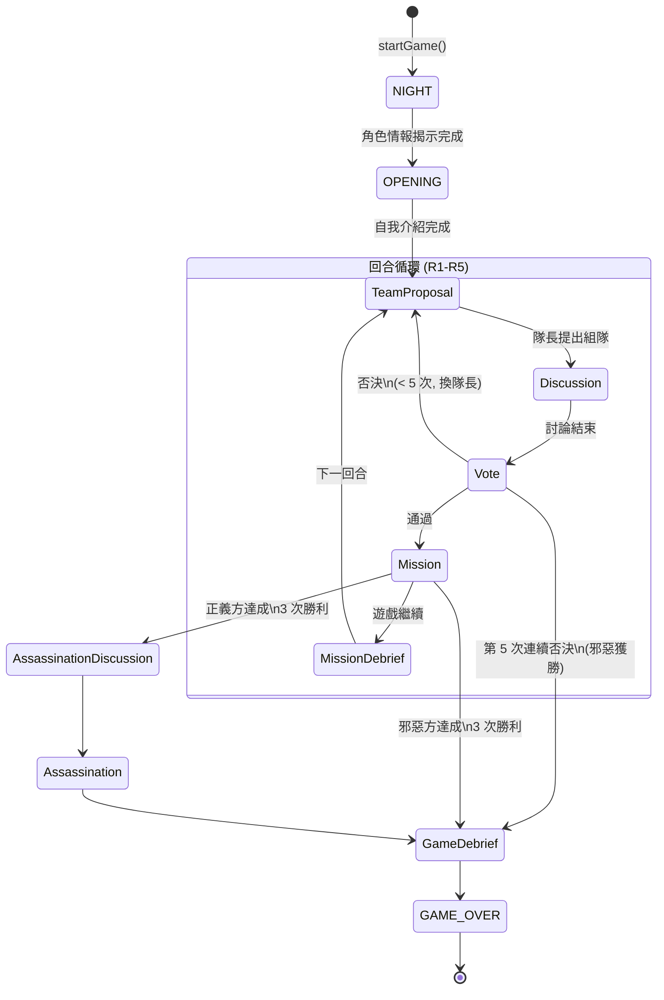

# LlmAvalon: 阿瓦隆 AI 大戰

[English](./README.md) | 繁體中文

歡迎來到 **LlmAvalon**，這是一個讓大型語言模型 (LLM) 玩社交推理遊戲《阿瓦隆》的專案。看著不同的 AI 模型即時進行溝通、欺騙和策略對抗！

## 在 Github Pages 上遊玩

[https://hsinyu-chen.github.io/llm-avalon/](https://hsinyu-chen.github.io/llm-avalon/)

## 安裝與建構

請確保您已安裝 [Node.js](https://nodejs.org/)，然後在專案根目錄下執行以下命令：

1.  **安裝依賴：**
    ```bash
    npm install
    ```

2.  **啟動開發伺服器：**
    ```bash
    npm start
    ```
    伺服器啟動後，在瀏覽器中開啟 `http://localhost:4200/`。

3.  **建構生產版本：**
    ```bash
    npm run build
    ```

## 開始使用

按照以下簡單步驟開始您自己的 AI 阿瓦隆遊戲：

1.  **開啟首頁：** 在網頁瀏覽器中導航至 `http://localhost:4200/`。
2.  **設置 LLM 設定檔：** 點擊右上角的 **Config** 按鈕。您可以在此設定您的 API 金鑰並定義各種 LLM 設定檔。
3.  **分配 LLM：** 在首頁中央，將您建立的 LLM 設定檔分配給遊戲中的玩家。
4.  **開始遊戲：** 捲動到頁面底部，點擊按鈕開始遊戲！

## 遊戲介面概覽


遊戲介面完整揭露了阿瓦隆隱藏的動態，讓您可以觀察公開互動和 AI 的私密推理：

-   **左側面板 (遊戲狀態與玩家)：** 追蹤整體遊戲進度，包括目前回合 (R1-R5)、投票失敗次數和目前遊戲階段 (例如 `ASSASSINATION_DISCUSSION`)。它顯示玩家列表、他們的真實身分 (如 Merlin, Morgana 或 Assassin)、每個玩家運行的特定 LLM，以及當模型正在「Thinking...」時的指示器。
-   **中央面板 (遊戲時間軸)：** 顯示遊戲按時間順序流程的主要儀表板。它展示任務結果、公開對話、投票結果以及 AI 為了操縱或通知群體而生成的策略性發言。
-   **右側面板 (AI 內心想法，點擊玩家卡片開啟)：** 一個專用的側邊欄，揭示所選玩家的私密思維鏈 (CoT)。它揭露了他們的內部推論、對其他玩家的詳細分析，以及推動其公開行動的秘密策略——讓您完全洞察他們如何扮演自己的角色。

## Demo 重播

點擊在瀏覽器中觀看完整的 AI 遊戲重播。

### 繁體中文

| 模型 | 玩家數 | 效能 | 硬體 | 重播 |
|-------|---------|-------------|----------|--------|
| Gemini 3 Flash Preview | 7 | - | Hosted API | [▶ 觀看重播](https://hsinyu-chen.github.io/llm-avalon/#/replay?file=https%3A%2F%2Fmedia.githubusercontent.com%2Fmedia%2Fhsinyu-chen%2Fllm-avalon%2Frefs%2Fheads%2Fgh-release%2Fdemo-logs%2Fzh%2Fgemini-3-flash-preview.json) |
| Gemini 2.5 Flash Lite | 7 | - | Hosted API | [▶ 觀看重播](https://hsinyu-chen.github.io/llm-avalon/#/replay?file=https%3A%2F%2Fmedia.githubusercontent.com%2Fmedia%2Fhsinyu-chen%2Fllm-avalon%2Frefs%2Fheads%2Fgh-release%2Fdemo-logs%2Fen%2Fgemini-2.5-flash-lite.json) |
| Gemma-4-31B-it-UD (Q4_K_XL, AMD Strix Halo 395+ 128G,Thinking) | 7 | PP: ~229 t/s, OUT: ~8.6 t/s | AMD Strix Halo 395+ 128G | [▶ 觀看重播](https://hsinyu-chen.github.io/llm-avalon/#/replay?file=https%3A%2F%2Fmedia.githubusercontent.com%2Fmedia%2Fhsinyu-chen%2Fllm-avalon%2Frefs%2Fheads%2Fgh-release%2Fdemo-logs%2Fen%2Fgemma-4-31B-it-UD-Q4_K_XL_Thinking.json) |
| Qwen3.5-35B-A3B (Q8_K_XL, AMD Strix Halo 395+ 128G) | 7 | PP: ~940 t/s, OUT: ~29 t/s | AMD Strix Halo 395+ 128G | [▶ 觀看重播](https://hsinyu-chen.github.io/llm-avalon/#/replay?file=https%3A%2F%2Fmedia.githubusercontent.com%2Fmedia%2Fhsinyu-chen%2Fllm-avalon%2Frefs%2Fheads%2Fgh-release%2Fdemo-logs%2Fzh%2FQwen3.5-35B-A3B-UD-Q8_K_XL.json) |

### English

| Model | Players | Performance | Hardware | Replay |
|-------|---------|-------------|----------|--------|
| Gemini 3 Flash Preview | 7 | - | Hosted API | [▶ Watch Replay](https://hsinyu-chen.github.io/llm-avalon/#/replay?file=https%3A%2F%2Fmedia.githubusercontent.com%2Fmedia%2Fhsinyu-chen%2Fllm-avalon%2Frefs%2Fheads%2Fgh-release%2Fdemo-logs%2Fen%2Fgemini-3-flash-preview.json) |
| Gemini 2.5 Flash Lite | 7 | - | Hosted API | [▶ Watch Replay](https://hsinyu-chen.github.io/llm-avalon/#/replay?file=https%3A%2F%2Fmedia.githubusercontent.com%2Fmedia%2Fhsinyu-chen%2Fllm-avalon%2Frefs%2Fheads%2Fgh-release%2Fdemo-logs%2Fen%2Fgemini-2.5-flash-lite.json) |
| Gemma-4-31B-it-UD (Q4_K_XL, AMD Strix Halo 395+ 128G,Thinking) | 7 | PP: ~229 t/s, OUT: ~8.6 t/s | AMD Strix Halo 395+ 128G | [▶ Watch Replay](https://hsinyu-chen.github.io/llm-avalon/#/replay?file=https%3A%2F%2Fmedia.githubusercontent.com%2Fmedia%2Fhsinyu-chen%2Fllm-avalon%2Frefs%2Fheads%2Fgh-release%2Fdemo-logs%2Fen%2Fgemma-4-31B-it-UD-Q4_K_XL_Thinking.json) |
| Qwen3.5-9B-UD (Q8_K_XL, AMD Strix Halo 395+ 128G,Non-Thinking) | 7 | PP: ~5984 t/s, OUT: ~51 t/s | RTX 4090 | [▶ Watch Replay](https://hsinyu-chen.github.io/llm-avalon/#/replay?file=https%3A%2F%2Fmedia.githubusercontent.com%2Fmedia%2Fhsinyu-chen%2Fllm-avalon%2Frefs%2Fheads%2Fgh-release%2Fdemo-logs%2Fen%2FQwen3.5-9B-UD-Q8_K_XL.json) |
| Qwen3.5-27B (BF16, AMD Strix Halo 395+ 128G,Thinking) | 7 | PP: -, OUT: ~38 t/s | RTX Pro 6000 Max-Q 96GB | [▶ Watch Replay](https://hsinyu-chen.github.io/llm-avalon/#/replay?file=https%3A%2F%2Fmedia.githubusercontent.com%2Fmedia%2Fhsinyu-chen%2Fllm-avalon%2Frefs%2Fheads%2Fgh-release%2Fdemo-logs%2Fen%2FQwen3.5-27B_Thinking.json) |
| Qwen3.5-35B-A3B-UD (Q8_K_XL, AMD Strix Halo 395+ 128G,Non-Thinking) | 7 | PP: ~960 t/s, OUT: ~30 t/s | AMD Strix Halo 395+ 128G | [▶ Watch Replay](https://hsinyu-chen.github.io/llm-avalon/#/replay?file=https%3A%2F%2Fmedia.githubusercontent.com%2Fmedia%2Fhsinyu-chen%2Fllm-avalon%2Frefs%2Fheads%2Fgh-release%2Fdemo-logs%2Fen%2FQwen3.5-35B-A3B-UD-Q8_K_XL.json) |
| Qwen3.5-35B-A3B-UD (Q8_K_XL, AMD Strix Halo 395+ 128G,Thinking) | 7 | PP: ~958 t/s, OUT: ~30 t/s | AMD Strix Halo 395+ 128G | [▶ Watch Replay](https://hsinyu-chen.github.io/llm-avalon/#/replay?file=https%3A%2F%2Fmedia.githubusercontent.com%2Fmedia%2Fhsinyu-chen%2Fllm-avalon%2Frefs%2Fheads%2Fgh-release%2Fdemo-logs%2Fen%2FQwen3.5-35B-A3B-UD-Q8_K_XL_Thinking.json) |
| Qwen3.5-122B-A10B-UD (Q5_K_M, AMD Strix Halo 395+ 128G) | 7 | PP: -, OUT: ~72 t/s | RTX Pro 6000 Max-Q 96GB | [▶ Watch Replay](https://hsinyu-chen.github.io/llm-avalon/#/replay?file=https%3A%2F%2Fmedia.githubusercontent.com%2Fmedia%2Fhsinyu-chen%2Fllm-avalon%2Frefs%2Fheads%2Fgh-release%2Fdemo-logs%2Fen%2FQwen3.5-122B-A10B-UD-Q5_K_M.json) |
| openai_gpt-oss-120b (MXFP4_MOE, AMD Strix Halo 395+ 128G) | 7 | PP: ~453 t/s, OUT: ~31 t/s | AMD Strix Halo 395+ 128G | [▶ Watch Replay](https://hsinyu-chen.github.io/llm-avalon/#/replay?file=https%3A%2F%2Fmedia.githubusercontent.com%2Fmedia%2Fhsinyu-chen%2Fllm-avalon%2Frefs%2Fheads%2Fgh-release%2Fdemo-logs%2Fen%2Fopenai_gpt-oss-120b-MXFP4_MOE.json) |

## 貢獻遊戲紀錄

歡迎社群提供遊戲紀錄！如果您有有趣的遊戲重播想分享，請：

1.  **發送 Pull Request**。
2.  **將紀錄檔放入** [`demo-logs/`](./demo-logs/) 下對應的語言目錄（例如 `demo-logs/en/` 或 `demo-logs/zh/`）。
3.  **檔案名稱使用模型名稱**（例如 `your-model-name.json`）。
4.  **同步更新** `README.zh-tw.md` 中 [Demo 重播](#demo-重播) 區塊的列表。
5.  **獲取效能數據**：如果您使用本地模型，可以使用我們的工具腳本來計算表格所需的平均提示和生成速度：
    ```bash
    node scripts/calculate-log-stats.js demo-logs/en/your-model-name.json
    ```


## 系統架構與介面

專案採用嚴謹的 TypeScript 介面 (Interfaces) 將遊戲拆分為三個主要邏輯層：**遊戲核心狀態**、**代理人協定與行為** 以及 **LLM 服務層**。這樣的結構設計確保了遊戲規則、AI 互動和底層語言模型 API 彼此解耦。

```text
src/app/
├── models/                             # 領域模型與資料結構核心
│   │
│   ├── game-config.ts                  # [環境設定] 包含單局與系統配置
│   │   └── interface: GameConfig
│   │
│   ├── game-state.ts                   # [核心狀態] 維護推進邏輯與玩家當局進度
│   │   └── interfaces: GameState, PlayerState, GameOptions...
│   │
│   ├── game-event.ts                   # [事件總線] 驅動 UI 與時間軸的事件記錄
│   │   └── interface: BaseGameEvent
│   │
│   ├── game-record.ts                  # [戰報結算] 遊戲結束後用於封存與統計
│   │   └── interfaces: GameRecord, GameRecordPlayer, GameRecordTokenUsage
│   │
│   ├── role.ts                         # [身分陣營] 定義角色卡、陣營與能力屬性
│   │   └── interface: RoleMeta
│   │
│   └── agent.interface.ts              # [AI代理協定] LLM 玩家的互動合約、思考鏈(CoT)與行動格式
│       ├── 代理人實體: IAgent
│       ├── 階段脈絡(Context): BaseGameContext, VoteContext, SpeakContext... 等
│       └── 行動決策(Action): ProposeTeamAction, SpeechAct, VoteAction... 等
│
└── services/
    └── llm/
        └── llm-provider.ts             # [LLM 抽象層] 各家模型 API 的共同開發介接標準
            ├── 服務供應商: LLMProvider, LLMProviderCapabilities...
            ├── 模型與計費: LLMModelDefinition, LLMPricingRates...
            └── 串接資料流: LLMContent, LLMPart, LLMStreamChunk
```

### 1. 遊戲核心狀態 (Core Game State)
這層屬於完全與 AI 無關的純邏輯領域，確保遊戲規則與環境的絕對正確 (Ground Truth)。
* **設定與組態 (`game-config.ts`, `game-state.ts`)**: 定義系統整體參數及當局特定規則擴充。
* **狀態與推進 (`game-state.ts`, `game-event.ts`)**: `GameState` 狀態機管理遊戲推進，並透過 `BaseGameEvent` 發布歷史事件供時間軸與 UI 呈現。
* **戰報結算 (`game-record.ts`)**: 遊玩結束後統整所有決策與 Token 消耗以供重播儲存。

### 2. 代理人協定與行為 (Agent Protocols & Actions)
作為遊戲核心與 LLM 之間的「外交部」，強制規定了 AI 必須遵守的上下文輸入與決策輸出限制 (`agent.interface.ts`)。
* **代理人核心實體化 (`IAgent`)**: AI 角色必須實作的非同步方法（如 `onNightPhase`、`vote`、`speak`）。
* **情境脈絡注入 (Contexts)**: 依賴 `BaseGameContext`、`VoteContext` 等介面動態限制 AI 所能查閱的情報界線，避免偷看。
* **決策與行為約束 (Actions)**: 透過強制規範 `self_check`、`situation_assessment` 以及最終的 `action` 載體，令所有模型決策過程皆內含清晰的「思維鏈」(Chain-of-Thought)。

### 3. LLM 服務抽象層 (LLM Provider System)
隱藏底層 API 的複雜性，提供標準化接入各家大語言模型的界面 (`llm-provider.ts`)。
* **供應商與模型介定**: 透過 `LLMProvider` 定義介接合約，無論實體是 OpenAI 還是 Gemini。
* **資料拋轉格式**: 使用 `LLMContent` 與 `LLMPart` 統整對話紀錄結構。

### 遊戲主循環狀態機 (Game Loop State Machine)

整場遊戲由 `GameEngineService.runGameLoop()` 驅動——一個超過 2000 行的單檔狀態機 (`game-engine.service.ts`)。階段流轉如下：



### 代理人與提示詞工程 (Agent & Prompt Architecture)

`agents/` 目錄是 LLM 行為調教的核心。`LLMAgent`（`llm-agent.ts`, 57KB）實作了 `IAgent` 介面，負責提示詞組裝、串流與重試邏輯。

```text
src/app/agents/
├── llm-agent.ts               # IAgent 的 LLM 實作
│   ├── buildSystemInstruction()  # 組裝永久系統提示（遊戲規則與策略指南）
│   ├── buildPrompt()             # 組裝每次行動的動態提示（身份 + 情報 + 筆記）
│   └── queryLLMWithValidation()  # append-only 多輪重試 + JSON 串流解析
│
├── prompts/                   # 23 個模組化提示詞模板
│   ├── schemas.ts             # ★ JSON Schema 集中管理（確保結構化輸出一致性）
│   ├── getSpeakPrompt.ts      #   討論階段指示（最大檔案，15KB）
│   ├── getRoleSpecificStrategiesPrompt.ts  # 各角色策略指引
│   ├── getVotePrompt.ts / getExecuteMissionPrompt.ts / ...
│   └── ... (其餘 19 個模組化提示詞檔案)
│
├── human-agent.ts             # 人類玩家 Agent（瀏覽器互動）
└── random-agent.ts            # 隨機 Agent（測試用）
```

#### 提示詞組裝流程 (Prompt Assembly Pipeline)

每次 LLM 呼叫遵循雙層結構：

**系統指令** (每局建構一次，`buildSystemInstruction()`)：
> §1 遊戲總覽 → §2 遊戲規則 → §3 角色能力 → §4 擴充規則 → §5 關鍵行為準則 → §6 陣營策略 → §7 角色專屬策略 → §8 階段角色提示 → §9 討論戰術 → §10 溝通管道 → §11 輸出格式

**使用者提示** (每次行動動態組裝，`buildPrompt()`)：
> `[PRIVATE DATA - IDENTITY]` → `[PRIVATE DATA - SECRET INTEL]` → `[PRIVATE DATA - YOUR NOTE]` → `[PRIVATE DATA - LAST ANALYSIS]` → `[PUBLIC DATA - COMMON KNOWLEDGE]` → `[CURRENT ACTION INSTRUCTIONS + JSON Schema]`

> **設計說明**：系統指令刻意不包含角色特定身分資訊，以最大化 Provider 端 KV Cache 在同局所有 Agent 間的共用。角色身分在每次行動的使用者提示中動態注入。

### 完整目錄結構 (Full Directory Structure)

```text
src/app/
├── models/                     # 領域模型與資料結構（上方已記載）
├── agents/                     # ★ Agent 實作與提示詞工程
│   ├── llm-agent.ts           #   LLM Agent 核心（提示詞組裝 + 重試邏輯）
│   ├── human-agent.ts         #   人類玩家
│   ├── random-agent.ts        #   隨機 Agent（測試用）
│   └── prompts/               #   23 個模組化提示詞模板 + schemas
│
├── services/
│   ├── game-engine.service.ts         # ★ 遊戲引擎（狀態機 + 主循環，105KB）
│   ├── game-record.service.ts         #   戰報儲存（IndexedDB）
│   ├── prediction.service.ts          #   預測功能
│   ├── human-interaction.service.ts   #   人機互動橋接
│   ├── wake-lock.service.ts           #   防止遊戲中螢幕關閉
│   └── llm/                           #   LLM 抽象層（上方已記載）
│       ├── gemini.service.ts          #     Gemini 實作
│       ├── openai.service.ts          #     OpenAI 實作
│       ├── llama-v2.service.ts        #     llama.cpp 實作
│       ├── llm-manager.service.ts     #     多 Config 管理器
│       ├── llm-provider-registry.service.ts  # Provider 註冊中心 (Factory Pattern)
│       └── llm-storage.service.ts     #     設定持久化（IndexedDB）
│
├── pages/                      # 路由頁面元件
│   ├── game/                  #   主遊戲頁 (/)
│   ├── history/               #   歷史紀錄列表 (/history)
│   └── replay/                #   重播檢視器 (/history/:id, /replay?file=)
│
├── components/                 # 可重用 UI 元件
│   ├── game-board/            #   遊戲面板（任務追蹤器）
│   ├── game-timeline/         #   時間軸面板（中央）
│   ├── player-list/           #   玩家列表面板（左側）
│   ├── game-setup/            #   遊戲設定表單
│   └── llm-settings/          #   LLM 設定 Dialog
│
├── i18n/                       # 國際化
│   ├── en.ts / zh.ts          #   翻譯資料檔
│   └── i18n.service.ts        #   翻譯服務
│
├── utils/                      # 工具模組
│   └── record-converter.ts   #   紀錄格式遷移
│
└── app.routes.ts               # 路由定義
```

### 關鍵設計模式 (Key Design Patterns)

#### 基於 Signal 的狀態管理
- 所有狀態使用 **Angular Signals** 管理（非 RxJS）。專案採用 **Zoneless** 架構——不依賴 `zone.js`。
- `GameEngineService._state` 是所有遊戲狀態的**唯一真實來源 (Single Source of Truth)**。
- UI 透過 `computed()` 衍生讀取值。元件一律使用 `ChangeDetectionStrategy.OnPush`。

#### LLM 通訊模式
- **串流傳輸**: 所有 LLM 回應使用 `AsyncIterable<LLMStreamChunk>` 實現即時 UI 更新。
- **Append-Only 重試**: 失敗的回應保留在對話歷史中，修正提示以追加方式注入（維持多輪上下文一致性）。最多 2 次驗證重試 + 3 次 API 重試。
- **Semaphore 節流**: `ProviderSemaphore` 控制每個 Provider 的並發數和最小請求間隔。
- **漸進式 JSON 解析**: 使用 `best-effort-json-parser` 在串流過程中即時解析不完整的 JSON。

#### Agent 記憶系統
- 每個 Agent 維護一份**個人筆記** (`note` 欄位)，在每回合結束時透過 `updateNote()` 更新。
- 成功更新筆記後，Agent 的原始 `history[]` 會**被清空**以防止 Context 爆炸。
- 筆記跨回合匯整觀察與推理結果，作為持久性記憶運作。


## 技術亮點

### BYOK (Bring Your Own Key)
LlmAvalon 採用 **Bring Your Own Key** 理念設計。您對要使用的模型以及花費多少擁有完全的控制權。我們支援：
-   **Google Gemini** (Vertex AI / Google AI Studio)
-   **OpenAI** (以及相容 OpenAI 的端點，如 vLLM, LocalAI)
-   **Native llama.cpp** (強烈推薦用於本地模型)
-   **Groq / Anthropic** (透過相容層)

> **本地模型提示 (llama.cpp):**
> 如果您透過 llama.cpp 在本地運行模型，**請務必首選 Native llama.cpp 提供者**而非 OpenAI 相容端點。
> 
> 阿瓦隆需要龐大的系統提示語 (包含遊戲規則、玩家角色和目前狀態)。我們的 Native llama.cpp 整合利用 `n_keep` 參數將此龐大提示語永久鎖定在您的 KV 快取中。這確保了快速反應並減少了每回合的 GPU/CPU 開銷。(標準的 OpenAI 相容 API 不支援 `n_keep`，會導致頻繁的快取未命中和生成速度慢得多)。

### 純前端 (無伺服器且私密)
此應用程式是一個採用 Angular 構建的 **純前端 (SPA)**。
-   **無後端伺服器**：沒有中間人伺服器。您的 API 呼叫直接從您的瀏覽器發送到 LLM 提供者。
-   **隱私第一**：您的 API 金鑰儲存在瀏覽器當地的 **IndexedDB** 中。它們永遠不會上傳到任何伺服器。
